# Password Cracking Lab — JTR & NetworkWalks Tools

## Overview

This repo covers **Week 3** of my Cybersecurity & Ethical Hacking training at NetworkWalks Academy, spanning **Project Module 1** and **Project Module 2**.

Both modules had the same end goal — recover the password protecting an encrypted PDF — but approached it two different ways:

1. **John the Ripper**, run from the terminal on Kali Linux — the classic, long-standing command-line password auditing tool.
2. **NetworkWalks' Hash Calculator and Password Cracker** — a pair of free browser tools that do the same job with zero setup.

Working through both gave me a good side-by-side look at a CLI-driven workflow versus an entirely browser-based one, using identical logic underneath. I ran the process across three separate locked PDFs to confirm it was repeatable, not a one-off result.

**Modules covered:**
- W3-PM1 — Password Cracking with JTR
- W3-PM2 — Password Cracking with NetworkWalks Tools

## What I Set Out to Do

- Pull a crackable hash out of a password-protected PDF
- Run a dictionary attack against that hash with John the Ripper
- Repeat the same recovery using NetworkWalks' browser tools instead
- Confirm each recovered password actually opens its file
- Compare how the two methods felt to use in practice

## Environment

| Item | Detail |
|---|---|
| OS | Kali Linux |
| CLI Tool | John the Ripper 1.9.0-jumbo (pre-installed) |
| Hash extraction (CLI) | `pdf2john` |
| Browser tool 1 | NetworkWalks Hash Calculator |
| Browser tool 2 | NetworkWalks Password Cracker |
| Target files | `MyLockedPDF1.pdf`, `MyLockedPDF2.pdf`, `MyLockedPDF3.pdf` |

## How the Two Paths Compare at a Glance

```
Locked PDF
   |
   |-- pdf2john (CLI) --> hash.txt --> john hash.txt --> password found
   |
   |-- NetworkWalks Hash Calculator (browser) --> $pdf$ hash --> NetworkWalks Password Cracker --> password found
```

Same starting point, same end result, two different routes to get there.

## Module 1 — Cracking It with John the Ripper

Since JTR ships with Kali by default, this one stayed entirely in the terminal.

### The starting point
Trying to open the file directly just prompts for a password with no way in.

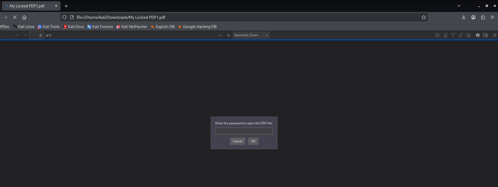

The file itself, sitting in my Downloads folder.

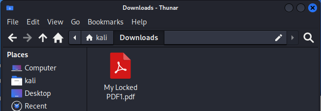

### Confirming John was ready to go
Running `john` with no arguments confirms it's installed and shows the basic usage.

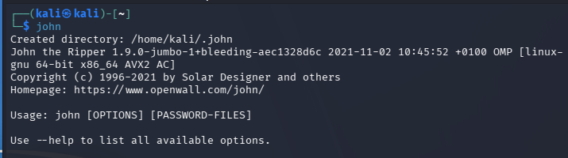

### Getting into position
Moved into the folder holding the target file.


### Extracting the hash
Used `pdf2john` to pull a crackable hash out of the PDF's encryption metadata. Had to quote the filename since it contains spaces.

```
pdf2john "My Locked PDF1.pdf" > hash.txt
```

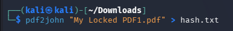

The resulting file held the hash in the expected `$pdf$...` format.

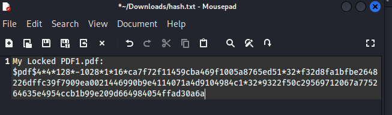

### Running the attack
```
john hash.txt
john --show hash.txt
```
John cracked it almost instantly against its default wordlist.

**Password recovered:** `good-luck`

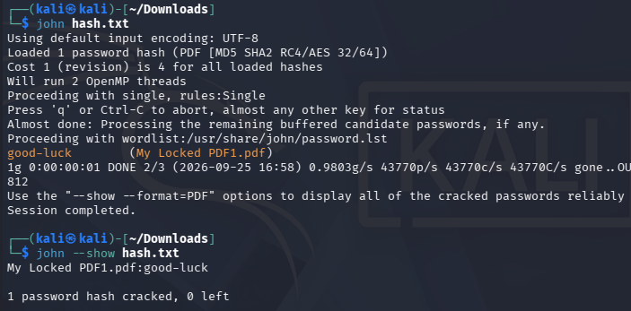

### Verifying by opening each file
Repeated the same workflow against all three target PDFs and opened each one with its recovered password to confirm the crack was accurate.


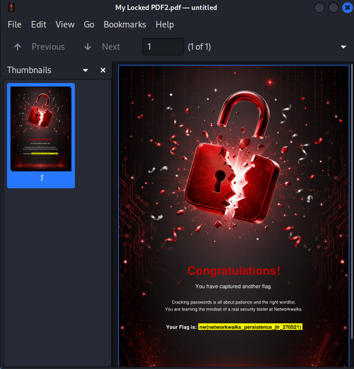
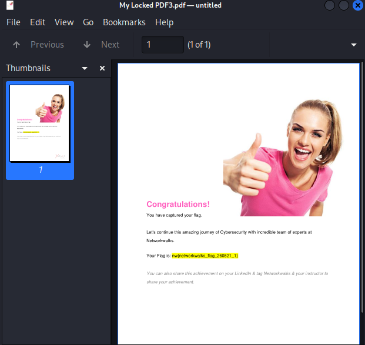

## Module 2 — Cracking It Again with NetworkWalks' Tools

Same target files, same goal, but entirely through the browser this time.

### Opening the Hash Calculator
Everything here runs client-side — no file is ever uploaded to a server.

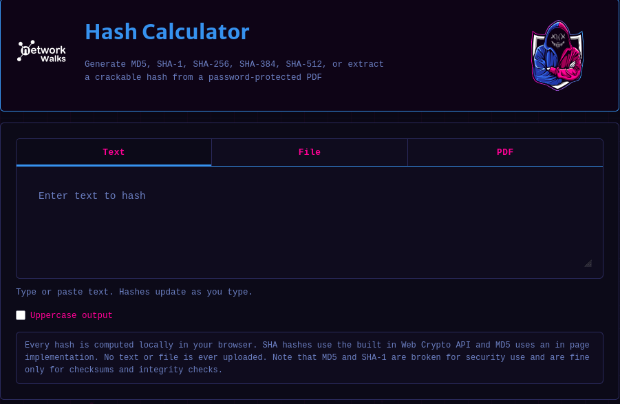

### Uploading a locked PDF
Switched to the PDF tab and selected the target file.

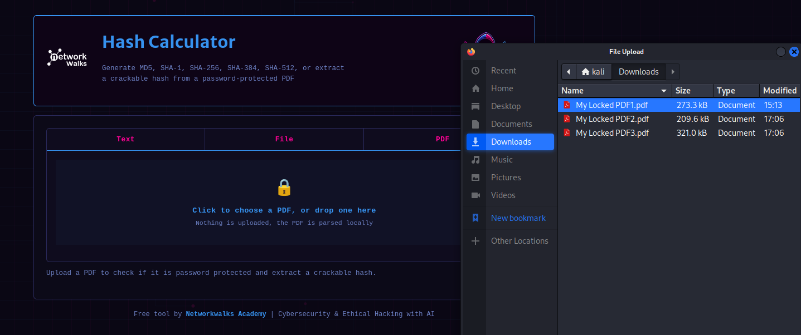

### Extracting the hash
The tool returned a hash in the same `$pdf$...` format `pdf2john` produces.

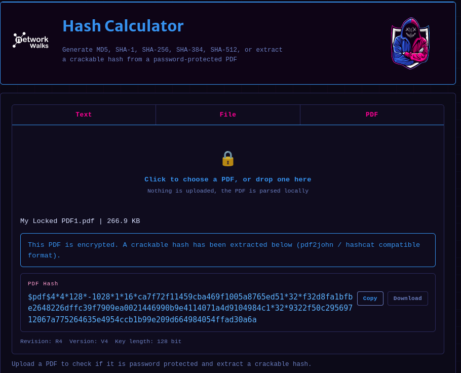

### Opening the Password Cracker
The companion tool runs the same underlying logic John the Ripper does — hash every candidate word and compare it against the target hash.

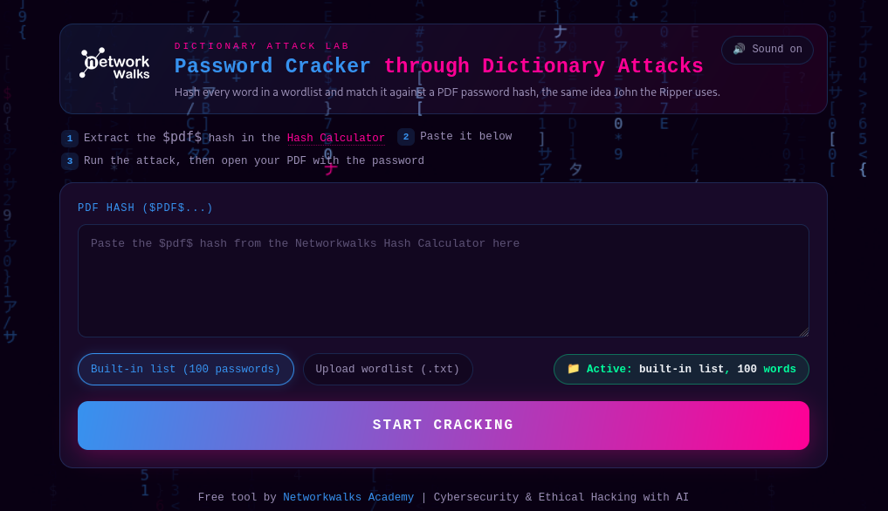

### Pasting in the hash
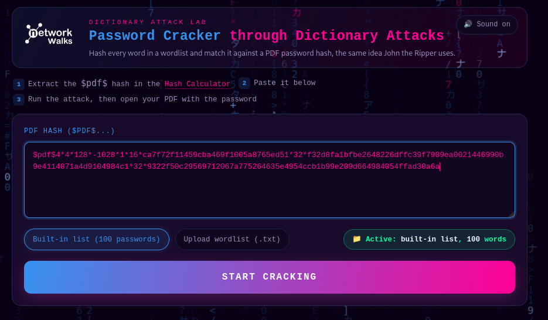

### Watching the attack run
The tool visibly works through its wordlist in real time, rejecting failed guesses as it goes.

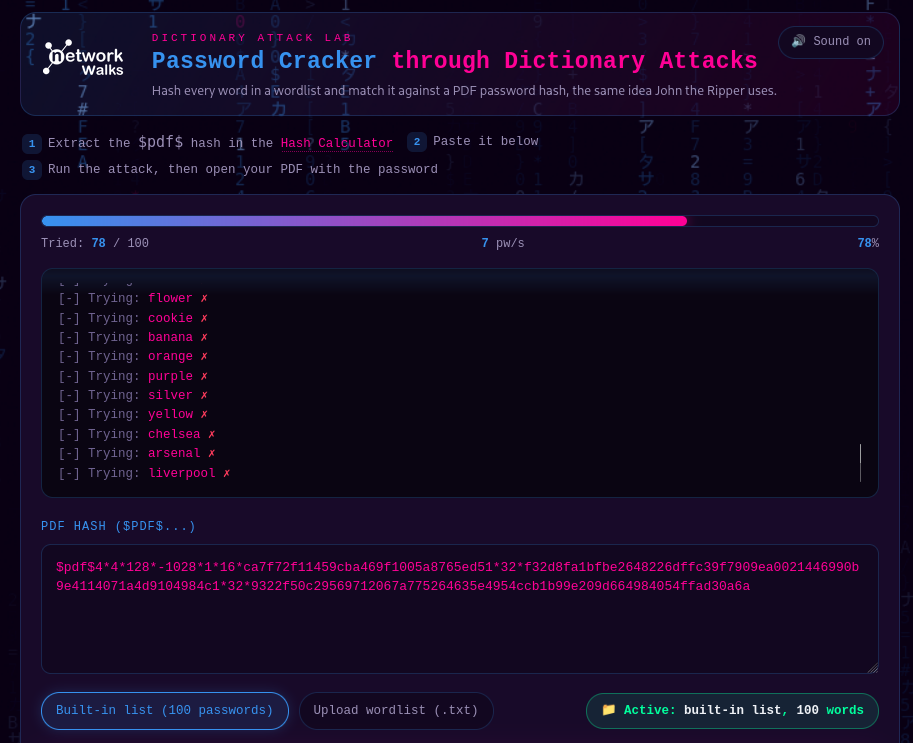

### Passwords cracked on the remaining files
Repeated the process for PDF2 and PDF3, each landing on a match.

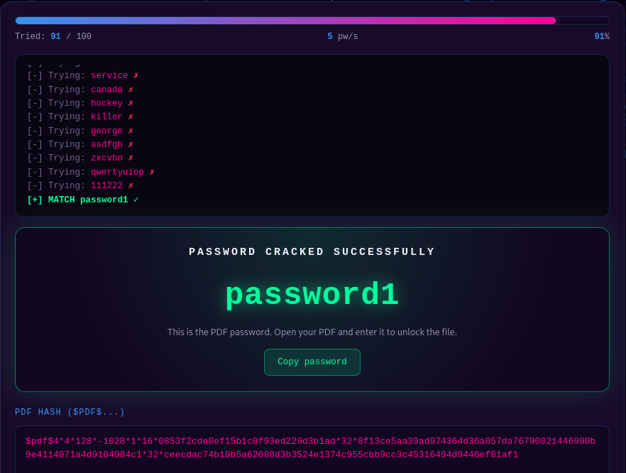
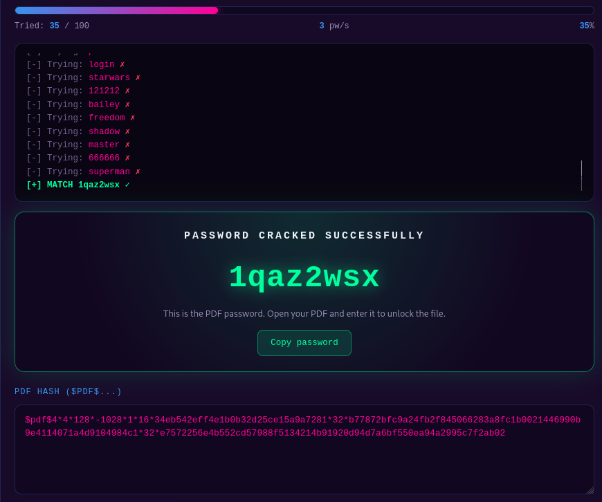

## Results

| File | Method | Password Recovered |
|---|---|---|
| My Locked PDF1.pdf | John the Ripper (CLI) | `good-luck` |
| My Locked PDF2.pdf | John the Ripper (CLI) | recovered, flag captured |
| My Locked PDF3.pdf | John the Ripper (CLI) | recovered, flag captured |
| My Locked PDF1.pdf | NetworkWalks Hash Calculator + Password Cracker | `good-luck` |
| My Locked PDF2.pdf | NetworkWalks Hash Calculator + Password Cracker | `password1` |
| My Locked PDF3.pdf | NetworkWalks Hash Calculator + Password Cracker | `1qaz2wsx` |

All six attempts across both methods and all three files ended in a successfully recovered password.

## CLI vs. Browser: My Take

| | John the Ripper | NetworkWalks Tools |
|---|---|---|
| Getting started | Already installed on Kali | Nothing to install, just open a browser tab |
| Extracting the hash | `pdf2john` script | Hash Calculator's PDF mode |
| Running the attack | Wordlist attack via John's engine | Wordlist attack via the built-in list |
| Watching it work | Mostly quiet until it finds a match | Shows each attempt live, easier to follow along |
| Where it fits | Feels more suited to serious, repeatable pentest work | Feels better for quick checks or just learning the concept |

Every file cracked to the same password regardless of which tool did the work, which was a good reminder that the tool is really just the delivery mechanism — the underlying attack (extract the hash, try candidates, compare, report a match) is the same idea whether it's running in a terminal or a browser tab.

## What I Took Away From This

Doing this across three files and two different tools made the theory click in a way just reading about it wouldn't have. None of these passwords — `good-luck`, `password1`, `1qaz2wsx` — stood much of a chance against either a proper wordlist tool or a lightweight browser one; all three fell within seconds. It also reframed how I think about a "hash" — it's not protection on its own, it's just a scrambled version of the password that's only as safe as the password itself is hard to guess.

## Scope & Ethics

Everything here was done against files provided specifically for this NetworkWalks training exercise, inside a controlled lab setup. None of the tools or steps documented here should be pointed at a file or system without clear authorization to do so.

## Project Info

**Program:** Cybersecurity & Ethical Hacking — NetworkWalks Academy
**Modules:** W3-PM1 (Password Cracking with JTR) & W3-PM2 (Password Cracking with NetworkWalks Tools)

## Author
*[Your name]*
Cybersecurity & Ethical Hacking Trainee
